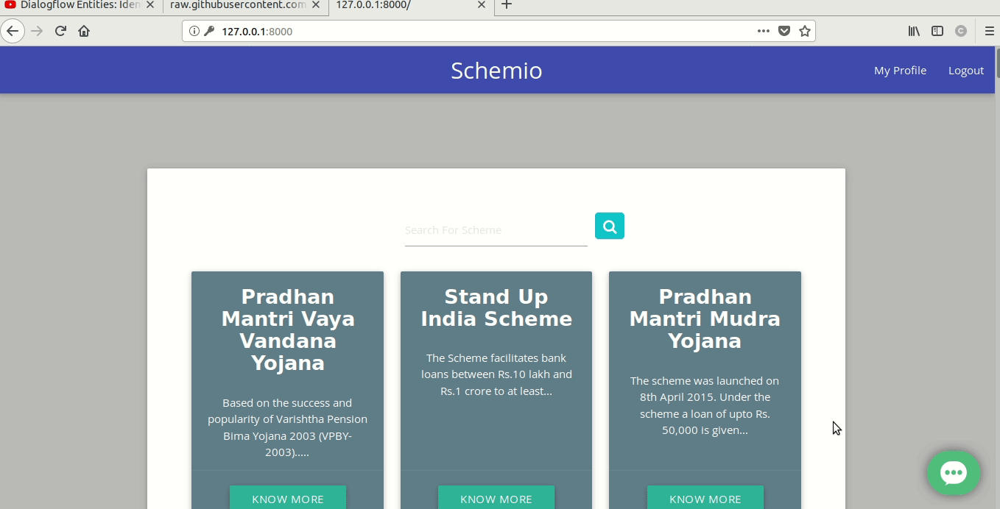

<p align="center">
  <a href="" rel="noopener">
 </a>
</p>

<h3 align="center">Easy to use government portal for increased convenience of users</h3>

<div align="center">

[](https://www.python.org/)
<br>


</div>

------------------------------------------

> Centralized government schemes portal that can be used either as a web app or live chat.


------------------------------------------
### Features

- Scraper and parser that dynamically scrape data from various government websites.

- A basic Chatbot that is used to help user navigate the website.

- Secured data storage.

<div align="center">

<h3> Schemio As Web-App  </h3>
<br>


<br>



</div>

------------------------------------------

### Add-Ons

- Sms/messenger based chatbot.

- Support for multiple language.

- Recommendation system based on submitted applications.

------------------------------------------
## File Structure


#### Web-App

- Repository [here](https://github.com/Korusuke/TSEC/tree/master/tsec)

------------------------------------------
### Installation and Deployment

Step 1:
- Update the `app/tsec/.env.example` and rename it to `.env`

Setp 2:
- Using docker-compose

```sh
        $ docker-compose up
```

- Using python

```sh
        $ cd app/
        $ pip3 install -r requirements.txt
        $ python manage.py makemigrations
        $ python manage.py migrate
        $ python manage.py collectstatic --noinput
        $ python manage.py runserver 0.0.0.0:8000
```

------------------------------------------
### Contributing

 We're are open to `enhancements` & `bug-fixes` :smile: Also do have a look [here](./CONTRIBUTING.md)

-------------------------------------------

### Note

- This project was done under `24 hours with no pre-preparation`

------------------------------------------
### Contributors

- [@Korusuke](https://github.com/Korusuke)
- [@RusherRG](https://github.com/RusherRG)
- [@akshay-99](https://github.com/akshay-99)
- [@Syn3rman](https://github.com/Syn3rman)
